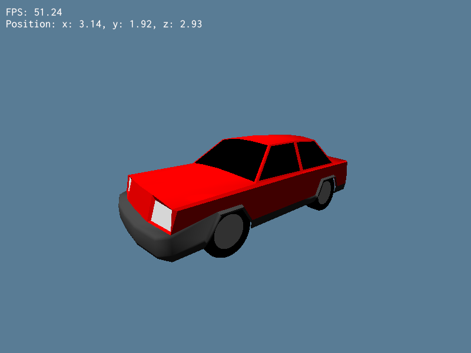

# A Random Wgpu Project

Project for practicing my Rust and wgpu skills.

This project won't be possible without this awesome learning **[source](https://sotrh.github.io/learn-wgpu/#what-is-wgpu)** and examples from official 
**[wgpu repo](https://github.com/gfx-rs/wgpu)**.

Main goal of this project, for now, is to make procedural world generation similar to Minecraft's.

